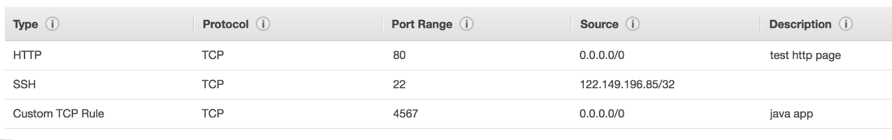

# EC2

## Metadata

```sh
#!/bin/bash
# Use this for your user data (script from top to bottom)
# install httpd (Linux 2 version)
yum update -y
yum install -y httpd
systemctl start httpd
systemctl enable httpd
echo "<h1>Hello World from $(hostname -f)</h1>" > /var/www/html/index.html
```

```sh
#!/bin/bash
# Use this for your user data (script from top to bottom)
# install httpd (Linux 2 version)
yum update -y
yum install -y httpd
systemctl start httpd
systemctl enable httpd

# Create a custom index.html with system details
cat <<EOF > /var/www/html/index.html
<html>
<head>
    <title>System Details</title>
</head>
<body>
    <h1>Hello World from $(hostname -f)</h1>
    <p>Visitor IP Address: \$(echo \$_SERVER['REMOTE_ADDR'])</p>
</body>
</html>
EOF

```

## Security Group

- Act like firewall for ec2 instance
- Control the inbound and outbound traffic.
    1. All inbound traffic are `blocked` by default.
    2. All outbound traffic are `allowed` by default.
- Authorize the ip ranges (IPv4 and IPv6).
- Access to ports.
- It contain only `allow` rules.



### Ports

| Port | Means | Use Case |
| ---- | ----- | -------- |
| 22   | SSH(Secure shell) | Log into a linux instance |
| 3389 | RDP(Remote Desktop Protocol) | Log into a window instance |
| 21   | FTP(File Transfer Protocol) | Upload files into a file share |
| 22   | SFTP(Secure File Transfer Protocol) | Upload file using ssh |
| 80   | Http | Access unsecured websites |
| 443  | Https | Access secured websites |

### SSH, Putty, Ec2 Instance Connect

| -  | SSH | Putty | Ec2 Instance Connect |
| -- | --- | ----- | -------------------- |
| Mac         | ✓ | × | ✓ |
| Linux       | ✓ | × | ✓ |
| Window < 10 | × | ✓ | ✓ |
| Window > 11 | ✓ | ✓ | ✓ |

### Notes

- Time Out issue  -> SG Issue.
- Connection Error -> Instance launch issue.
- Maintain 1 SG for SSH also. [maintain the SG for common things as one, reuse in other.]
- Can be attached to many instance and a instance can also have many SG.
- If instances have same SG. they can interact each other.

## SSH log into linux

```sh
ssh ec2-user@public-ip-address-of-instance
# you will get error as key is not configured.
ssh -i pemFile ec2-user@public-ip-address-of-instance
# you may get another error for that give permission to file... you should be on root folder.
chmod 0400 pemFile

# Download file from instance to your local system.
scp -i ~/DemoEc2KeyPair.pem ec2-user@34.248.173.8:/home/ec2-user/ml.txt ~/Downloads/example.txt

# Exit
exit
ctrl+d
logout
```
