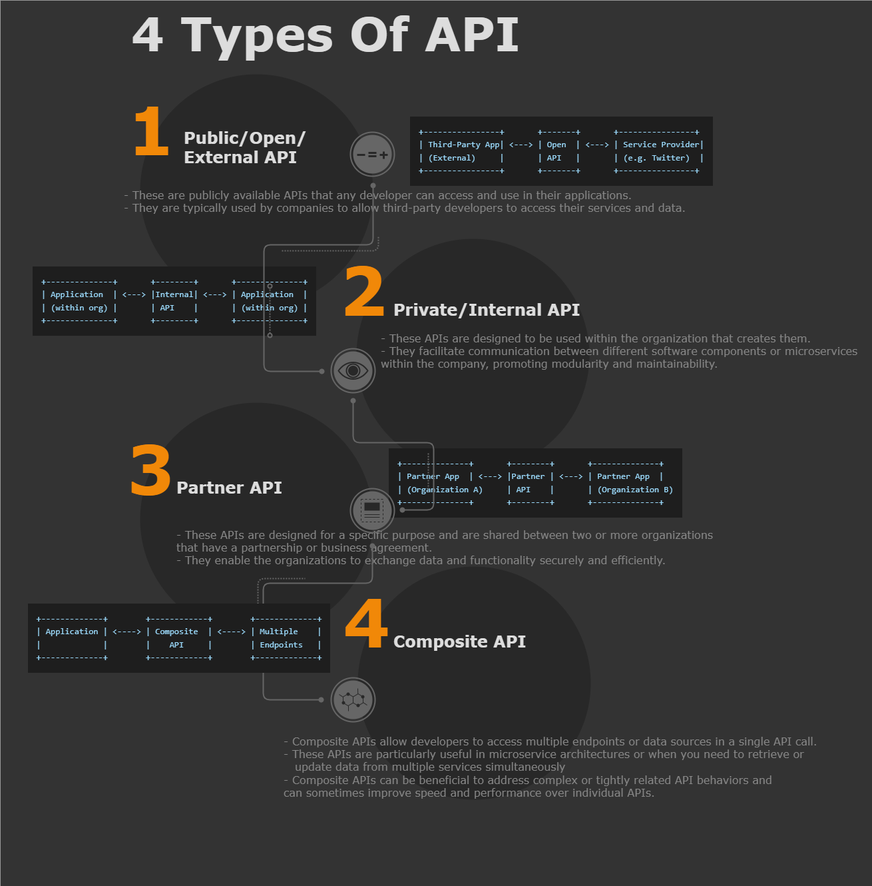

# API

- `Application Programming Interface` is abbreviated as API.
- It is a software intermediary that allows two application to talk to each other.

## Types of API



There are several types of APIs, commonly categorized by their scope and the protocols they use:

### Based on scope

- **Public APIs**: Also known as external or open APIs, are available to developers and other users with minimal restrictions.
- **Private APIs**: Also known as internal APIs, are used within an organization to improve products and services.
- **Partner APIs**: Are exposed to strategic business partners and are not available publicly. They facilitate collaboration between an organization and its partners.
- **Composite APIs**: Combine different data and service APIs. They are used to speed up the process of executing and retrieving data from different API services.

### Based on the protocols

- **REST APIs**: Use HTTP/HTTPS protocols and are designed based on RESTful principles.
- **SOAP APIs**: Use the Simple Object Access Protocol and are highly structured with strict standards.
- **GraphQL APIs**: Allow clients to request only the data they need and nothing more.
- **gRPC APIs**: Developed by Google, it uses HTTP/2 and Protocol Buffers for efficient, low-latency communication.
- **WebSocket APIs**: Provide full-duplex communication channels over a single TCP connection for real-time data transfer.

## Benefits of API

- **Abstraction**: APIs provide a layer of abstraction, hiding the complex underlying implementation details and exposing only what is necessary for the user.
- **Modularity**: APIs allow developers to create modular software, where different components can be developed, updated, and maintained independently.
- **Reusability**: APIs enable the reuse of services and functionalities, reducing redundancy and facilitating the development process.
- Interoperability**: They promote interoperability among different software systems, making it easier to integrate and communicate between them.
- **Efficiency**: By allowing access to only the necessary data or functionality, APIs can improve the efficiency of systems by reducing resource consumption and improving response times.
- **Scalability**: Well-designed APIs can help systems scale more easily by allowing for the distribution of services across multiple servers or even different geographical locations.
- **Security**: APIs can act as gatekeepers, ensuring that only authorized users can access certain functionality or data, thus enhancing the security of the system.
- **Standardization**: APIs often follow industry standards (e.g., REST, SOAP, GraphQL), which makes them predictable and easier to work with.
- **Innovation**: They enable developers to build on the capabilities of existing services, fostering innovation by allowing the creation of new features and functionalities that leverage these services.
- **Economic Growth**: APIs can be monetized directly by charging for access or indirectly by expanding the reach of services, thereby contributing to economic growth.
- **Rapid Development**: APIs can significantly speed up the development process by providing ready-made functions and services, allowing developers to focus on building unique features for their applications.

## Http Request & Response contains
  
- Http Request Contains
  - Request Body
  - Http Header
  - Http Method

- Http Response Contains
  - Response Body
  - Http Header
  - Http StatusCodes

## HTTP Verb/Method

- **Get**: To Retrieve the resources.
- **Post**: To Create new resources.
- **PUT**: To create/update the resources.
- **Delete**: To delete the existing resource.
- **PATCH**: To partial update the existing resource.
- **HEAD**: Similar to get but it retrieve the header information only of resource, not the actual data.
- **OPTIONS**: Describes the communication options available for the target resource, allowing the client to determine which HTTP methods are supported.
- **CONNECT**: Establishes a tunnel to the server identified by the target resource, often used for SSL tunneling.
- **TRACE**: Performs a message loop-back test along the path to the target resource, mainly for diagnostic purposes.

## REST(REpresentational State Transfer) API(Application Program Interface) Constraints

- [A Restful system consists of a](https://www.geeksforgeeks.org/rest-api-architectural-constraints/):

```text
    client who requests for the resources.
    server who has the resources.
```

- There are six architectural constraints
  - **Uniform Interface**:
    - It is a key constraint that differentiate between a REST API and Non-REST API. It suggests that there should be an uniform way of interacting with a given server irrespective of device or type of application (website, mobile app).

  - **Stateless**:
    - Each request from the client to the server must contain all the information necessary to understand and complete the request. The server does not store any session information about the client between requests.

  - **Cacheable**:
    - Every response should include whether the response is cacheable or not and for how much duration responses can be cached at the client side.
    - Client will return the data from its cache for any subsequent request and there would be no need to send the request again to the server.
    - A well-managed caching partially or completely eliminates some client–server interactions, further improving availability and performance.
    - But sometime there are chances that user may receive stale data.

  - **Client-Server**:
    - Rest api should have client and server.
    - This constraint essentially means that client applications and server applications MUST be able to evolve separately without any dependency on each other.
    - A client should know only resource URIs, and that’s all.

  - Layered System
    - The client cannot ordinarily tell whether it is connected directly to the end server or to an intermediary along the way.
    - Intermediary servers can improve system scalability by enabling load-balancing and by providing shared caches. They can also enforce security policies.
    - REST allows you to use a layered system architecture where you deploy the APIs on server A, and store data on server B and authenticate requests in Server C, for example.

  - Code on Demand (Optional):
    - It is an optional feature. According to this, servers can also provide executable code to the client.
    - The examples of code on demand may include the compiled components such as Java Servlets and Server-Side Scripts such as JavaScript.

## HTTP Headers

- Client and server can pass the extra bit of information with request and response using http headers.
- 4 type of http headers
  - General Headers (common to both requests and responses):
    - `Cache-Control`: Directives for caching mechanisms in both requests and responses.
    - `Connection`: Control options for the current connection (e.g., `keep-alive`, `close`).
    - `Date`: The date and time at which message was sent.
    - `Transfer-Encoding`: The form of encoding used to safely transfer the entity to the user (e.g., `chunked`).
    - `Upgrade`: Ask the server to upgrade to another protocol (e.g., from HTTP/1.1 to HTTP/2).
    - `Via`: Information about the intermediate protocols and recipients.

  - Request Headers (specific to HTTP requests):
    - `Accept`: Content-Types that the client is able to understand.
    - `Accept-Encoding`: Content encodings that the client is able to understand (e.g., `gzip`, `deflate`).
    - `Authorization`: Authentication credentials for HTTP authentication.
    - `Host`: The domain name of the server and the TCP port number on which the server is listening.
    - `User-Agent`: Information about the user agent (e.g., web browser or other client) making the request.
    - `Cookie`: Previously stored cookies that the client is sending back to the server.

  - Response Headers (specific to HTTP responses):
    - `Access-Control-Allow-Origin`: Specifies which origins are allowed to read the response as part of the CORS standard.
    - `ETag`: Version identifier for the associated entity, which can be used for cache validation.
    - `Location`: Used in redirection or when a new resource has been created; it provides the URL to that resource.
    - `Server`: Information about the software used by the origin server.
    - `Set-Cookie`: Cookies that the server instructs the client to store and send back in subsequent requests.
    - `WWW-Authenticate`: Indicates the authentication scheme that should be used to access the requested resource.

  - Entity Headers (describe the content of the body data):
    - `Content-Length`: The length of the response body in octets (8-bit bytes).
    - `Content-Type`: The MIME type of the body of the request or response.
    - `Content-Encoding`: The encoding transformations that have been applied to the body data.
    - `Content-Language`: The natural language or languages of the intended audience for the enclosed content.
    - `Last-Modified`: The date and time at which the associated entity was last modified.

## HTTP StatusCode

- Server always return the http status code with the response

1. 1xx (Informational): The request was received, and the process is continuing.
   - `100 Continue`: The initial part of a request has been received, and the client should continue with the request.
   - `101 Switching Protocols`: The server agrees to switch protocols as requested by the client (e.g., upgrading to a newer HTTP version).

2. 2xx (Success): The action was successfully received, understood, and accepted.
   - `200 OK`: Standard response for successful HTTP requests.
   - `201 Created`: The request has been fulfilled and resulted in a new resource being created.
   - `202 Accepted`: The request has been accepted for processing, but the processing has not been completed.
   - `204 No Content`: The server successfully processed the request, but is not returning any content.

3. 3xx (Redirection): Further action must be taken to complete the request.
   - `301 Moved Permanently`: The requested resource has been moved to a new URL permanently.
   - `302 Found`: The requested resource resides temporarily under a different URL.
   - `304 Not Modified`: The resource has not been modified since the last request (often used for caching).

4. 4xx (Client Error): The request contains bad syntax or cannot be fulfilled.
   - `400 Bad Request`: The server cannot process the request due to a client error (e.g., malformed request syntax).
   - `401 Unauthorized`: The request requires user authentication.
   - `403 Forbidden`: The server understood the request, but is refusing to fulfill it.
   - `404 Not Found`: The server has not found anything matching the Request-URI.
   - `405 Method Not Allowed`: The method specified in the Request-Line is not allowed for the resource identified by the Request-URI.

5. 5xx (Server Error): The server failed to fulfill an apparently valid request.
   - `500 Internal Server Error`: A generic error message, given when an unexpected condition was encountered.
   - `501 Not Implemented`: The server does not support the functionality required to fulfill the request.
   - `502 Bad Gateway`: The server received an invalid response from the upstream server.
   - `503 Service Unavailable`: The server is currently unable to handle the request due to temporary overloading or maintenance.
   - `504 Gateway Timeout`: The server did not receive a timely response from the upstream server.

## Secure the API

Securing an API encompasses multiple layers of security, including authentication, authorization, input validation, and secure communication protocols. Below are some practices and techniques to secure an API in .NET Core:

1. Authentication:
   - Use Identity Server, Auth0, or Azure Active Directory for implementing robust authentication.
   - Implement OAuth 2.0 or OpenID Connect for secure token-based authentication.
   - Use JSON Web Tokens (JWT) to securely transmit information between parties.

2. Authorization:
   - Implement role-based or policy-based authorization to ensure users can only access resources they are permitted to.
   - Use the `[Authorize]` attribute in .NET Core to protect your API endpoints.

3. Secure Communication:
   - Enforce HTTPS to encrypt data in transit using TLS/SSL. This prevents man-in-the-middle attacks.
   - Use HSTS (HTTP Strict Transport Security) to ensure clients always use HTTPS when communicating with your API.

4. Input Validation:
   - Always validate inputs on the server side to prevent SQL injection, cross-site scripting (XSS), and other injection attacks.
   - Use model validation in .NET Core to enforce input rules.

5. CORS (Cross-Origin Resource Sharing):
   - Configure CORS carefully to specify which domains can access your API. Avoid using the wildcard '*' to allow all domains.

6. API Throttling and Rate Limiting:
   - Protect your API from abuse and overuse by implementing rate limiting.
   - Use built-in middleware or third-party libraries like AspNetCoreRateLimit.

7. API Versioning:
   - Implement versioning to maintain a stable API while evolving and adding new features.

8. API Keys:
   - Although not a robust security measure, API keys can be used to monitor and control how the API is being used.

9. Logging and Monitoring:
   - Implement logging to track API usage and errors. This can help you detect and respond to security incidents quickly.
   - Integrate with monitoring tools to alert you of suspicious activities.

10. Data Protection:
    - Protect sensitive data using encryption at rest and in transit.
    - Use the Data Protection API in .NET Core to securely handle sensitive data.

11. Dependency Management:
    - Keep all your packages and dependencies up to date to avoid vulnerabilities found in older versions.
    - Use tools like NuGet Package Manager and consider automated security scanning to identify vulnerable dependencies.

12. Error Handling:
    - Implement global error handling to prevent leakages of stack traces or other sensitive information in error messages.

13. Security Headers:
    - Use security headers like Content Security Policy (CSP), X-Content-Type-Options, X-Frame-Options, etc., to protect your API from common attacks.

14. Container Security (if using containers):
    - Secure your containerized environment by following best practices for container orchestration with tools like Kubernetes.

15. Automated Security Testing:
    - Implement automated security testing in your CI/CD pipeline to catch security issues early.

## Stateless and Stateful

### Stateless

- In a stateless API, each request from a client must contain all the information necessary to understand and fulfill the request.
- The server does not store any session information about the client between requests. This makes the API easier to scale and more fault-tolerant since requests can be processed independently.

### Stateful

- In a stateful API, the server maintains session information about the client between requests.
- This can be useful for maintaining user-specific data or tracking the state of a multi-step process.
- However, stateful APIs can be harder to scale since the server must maintain session state across multiple requests.

### Comparisons Between Stateless and Stateful Protocol

| Stateless Protocol | Stateful Protocol |
| -- | -- |
| Stateless Protocol does not require the server to retain the server information or session details. | Stateful Protocol require server to save the status and session information. |
| In Stateless Protocol, there is no tight dependency between server and client. | In Stateful protocol, there is tight dependency between server and client |
| The Stateless protocol design simplify the server design. | The Stateful protocol design makes the design of server very complex and heavy. |
| Stateless Protocols works better at the time of crash because there is no state that must be restored, a failed server can simply restart after a crash.  | Stateful Protocol does not work better at the time of crash because stateful server have to keep the information of the status and session details of the internal states. |
| Stateless Protocols handle the transaction very quickly. |  Stateful Protocols handle the transaction very slowly. |
| Stateless Protocols are easy to implement in Internet.  | Stateful protocols are logically heavy to implement in Internet. |
| Scaling architecture is relatively easier. | It is difficult and complex to scale architecture. |
| The requests are not dependent on the server side and are self contained. |  The requests are always dependent on the server side. |
| To process different information at a time , different servers can be used.  | To process every request , the same server must be utilized. |
| Example of Stateless are UDP , DNS , HTTP , etc. |   Example of Stateful are FTP , Telnet , etc. |

### References

- [https://www.geeksforgeeks.org/difference-between-stateless-and-stateful-protocol/](https://www.geeksforgeeks.org/difference-between-stateless-and-stateful-protocol/)

## Rate Limiting

- API rate limiting is a security practice that limits the number of requests a client can make to an API within a set time frame. 
- It helps prevent abuse, misuse, or overloading of the API infrastructure.

### Common rate limiting algorithms

- Leaky bucket
- Token bucket
- Fixed window
- Sliding log
- Sliding window

## API Throttling

- API throttling is a specific type of rate limiting that involves intentionally delaying or limiting the number of requests a client can make to an API.
- It is often used to prevent clients from overloading the API server or to ensure fair usage of resources.
- Throttling can be implemented by delaying requests, returning error responses, or limiting the number of requests accepted by the server.
- Throttling can be useful in scenarios where the server is under heavy load or when clients are making too many requests.

### Key Difference b/w Rate limiting and Api throttling

- Rate limiting is a broader term that encompasses various techniques to control the rate of requests to an API, while API throttling is a specific type of rate limiting that involves delaying or limiting the number of requests.
- Rate limiting can be used to prevent abuse, misuse, or overloading of the API infrastructure, while throttling is often used to manage client requests and ensure fair usage of resources.
- Rate limiting can be implemented using algorithms such as leaky bucket, token bucket, fixed window, sliding log, or sliding window, while throttling can involve delaying requests, returning error responses, or limiting the number of requests accepted by the server.

### Products and tools that can be used to implement API rate limiting

- Amazon API Gateway
- Google Cloud Endpoints
- Azure Api Management
- Kong Gateway
- NGINX
- Express Rate Limit
- RateLimit.js
- Spring Cloud Gateway

- Tyk
- RateLimiter.io
- AWS WAF
- Azure Front Door
- Gloo Gateway
- Apigee

### References

- [https://medium.com/@bijit211987/everything-you-need-to-know-about-rate-limiting-for-apis-f236d2adcfff](https://medium.com/@bijit211987/everything-you-need-to-know-about-rate-limiting-for-apis-f236d2adcfff)
