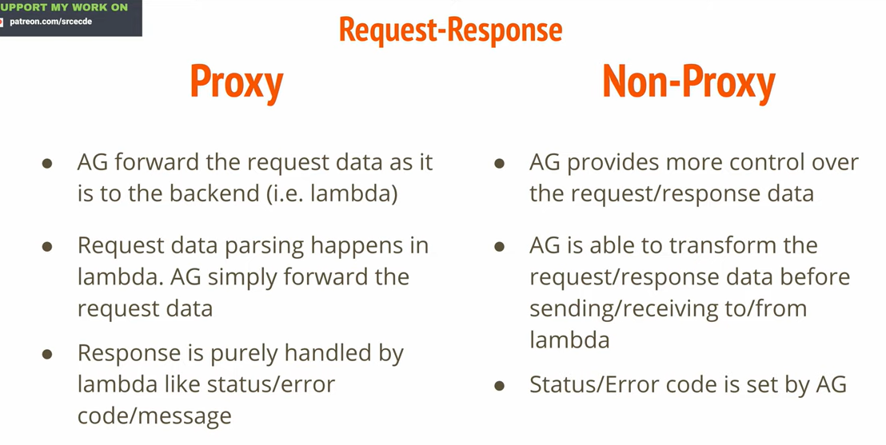

# Api Gateway

- An API gateway is indeed a type of proxy server that stands in the way of communication between apps and backend services. 
- An API gateway manages client requests, sends them to the proper backend service, receives the response, and then sends the client the response.
- Additional features like verification, caching and rate limiting can also be offered by API gateways.

## Proxy an Non-proxy lambda integration

## Amazon API Gateway offers several advantages over other API management solutions:

1. `Scalability`: It automatically scales with the number of requests, ensuring high performance even during traffic spikes.
2. `Flexibility`: Supports various protocols (RESTful and WebSocket) and integrates seamlessly with AWS services like Lambda, EC2, and S3.
3. `Security`: Offers multiple authentication methods, including IAM roles, Cognito User Pools, and custom authorizers using Lambda functions.
4. `Cost-effectiveness`: Pay-as-you-go pricing model eliminates upfront costs and allows for cost optimization based on usage patterns.
5. `Monitoring & Logging`: Integrates with CloudWatch and X-Ray for real-time monitoring, logging, and tracing of API calls.
6. `Customization`: Allows custom domain names, SSL certificates, and SDK generation for client applications.
