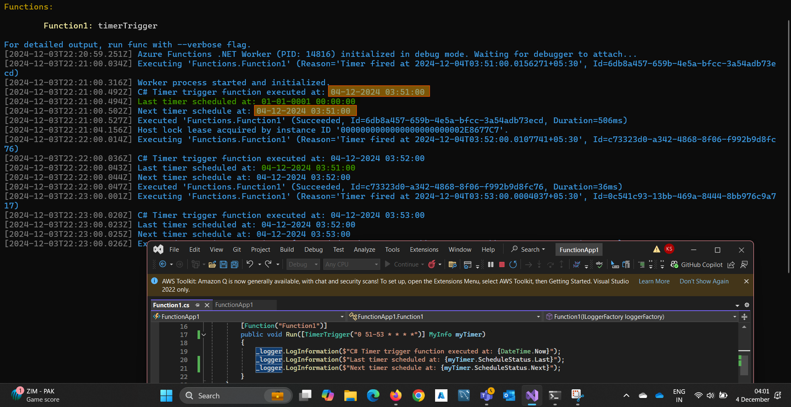

# Azure Function

## What are Azure Functions?

    Serverless compute service to run event-driven code without managing infrastructure.
    Use cases: Data processing, APIs, automation.

## Triggers

    Define how the function is invoked.
    Examples: HTTP Trigger, Timer Trigger, Queue Trigger, Blob Trigger.

```c#
[FunctionName("HttpExample")]
public IActionResult Run([HttpTrigger(AuthorizationLevel.Function, "get")] HttpRequest req)
{
    return new OkObjectResult("Triggered by HTTP request.");
}
```

## Bindings

    Connect to other Azure resources without code (Input and Output bindings).
    Example: Write data to a Blob.

```c#
        [FunctionName("BlobOutputExample")]
        public async Task Run([HttpTrigger(AuthorizationLevel.Function, "post")] HttpRequest req,
                              [Blob("sample-container/{rand-guid}.txt", FileAccess.Write)] Stream outputBlob)
        {
            using var writer = new StreamWriter(outputBlob);
            await writer.WriteAsync("Data written to blob!");
        }
```

## Authorization Levels
        Anonymous, Function, Admin for securing HTTP functions.

### Anonymous: No authentication required.

    Use case: Public endpoints like health checks.
    Example:

```c#
    [FunctionName("PublicEndpoint")]
    public IActionResult Run([HttpTrigger(AuthorizationLevel.Anonymous, "get")] HttpRequest req)
    {
        return new OkObjectResult("This is a public endpoint.");
    }
```

### Function: Requires a function key (provided in the query string or headers).

    Use case: Internal or shared APIs where keys are distributed.
    Example:

```c#
    [FunctionName("InternalApi")]
    public IActionResult Run([HttpTrigger(AuthorizationLevel.Function, "get", "post")] HttpRequest req)
    {
        return new OkObjectResult("Function-level secured endpoint.");
    }
```

### Admin: Requires an admin key.

    Use case: Management or admin-only operations.
    Example:

```c#
        [FunctionName("AdminApi")]
        public IActionResult Run([HttpTrigger(AuthorizationLevel.Admin, "delete")] HttpRequest req)
        {
            return new OkObjectResult("Admin-level secured endpoint.");
        }
```

Key Points:

    Function and Admin keys can be managed in the Azure Portal.
    Combine authorization levels with Azure AD or custom authentication for added security.
### Difference Between Function and Admin Authorization:

| Aspect     | Function | Admin |
| ---------- | -------- | ------- |
| Access Key | Requires Function Key |	Requires Admin Key |
| Scope	     | Limited to specific function(s) |	Grants access to all functions in the app |
| Use Case	 | Per-function secured access |	Global administrative operations |

## Durable Functions
        Build stateful workflows using an orchestrator.
        Use cases: Long-running processes like approval workflows.

    Hosting Plans
        Consumption Plan: Auto-scale, pay-per-execution.
        Premium Plan: Pre-warmed instances for lower latency.
        Dedicated Plan: Runs on pre-allocated VMs.

## Deployment
        Methods: Azure Portal, VS Code, Azure DevOps, GitHub Actions.
        Tools: Azure CLI, ARM Templates, Terraform.

## Scaling
        Automatically scales based on the trigger (e.g., HTTP requests, queue size).

## Monitoring
        Use Azure Monitor, Application Insights, or Log Analytics.

Example: Timer Trigger

```c#
[FunctionName("TimerExample")]
public void Run([TimerTrigger("0 */5 * * * *")] TimerInfo timer, ILogger log)
{
    log.LogInformation($"Function executed at: {DateTime.Now}");
}
```

Key Features:

    Language Support: C#, JavaScript, Python, Java, etc.
    Integration: Azure Storage, Cosmos DB, Service Bus, Event Grid.
    Dev Tools: Local testing with Azure Functions Core Tools.

## Cron format

Azure Functions use a six-field CRON format:

```
{second} {minute} {hour} {day} {month} {day-of-week}

Range
Second: Values from 0–59.
Minute: Values from 0–59.
Hour: Values from 0–23.
Day: Values from 1–31.
Month: Values from 1–12.
Day-of-week: Values from 0–7 (Sunday is both 0 and 7).
```

Explanation of 0 */5 * * * *

    0: At the 0th second of the minute.
    */5: Every 5 minutes.
    *: Every hour, every day, every month, and every day of the week.

Result: Runs every 5 minutes, at the start of each minute (e.g., 12:00:00, 12:05:00, etc.).

Common CRON Examples
| Expression     |	Description |
| -------------- | ------------ |
| 0 0 * * * *    | Every hour (on the hour). |
| 0 0 9 * * *    | Daily at 9:00 AM. |
| 0 0 9 * * 1    | Every Monday at 9:00 AM. |
| 0 0 9 1 * *    | At 9:00 AM on the 1st of every month. |
| 0 0 9 1 1 *    | At 9:00 AM on January 1st. |
| 0 0/15 * * * * | Every 15 minutes. |
| 0 37/1 * * * * | This expression starts at the 37th minute of the hour and runs every minute for the rest of the hour. Example: For an hour (e.g., 12:00 to 12:59), it would run at: 12:37, 12:38, 12:39, ..., up to 12:59. |
| 0 1/1 * * * *  | This starts at the 1st minute of the hour (e.g., 12:01, 12:02, 12:03, and so on). The task skips the 0th minute (e.g., 12:00, 1:00, etc.). |
| 0 */1 * * * *  | Starts at the 0th minute (e.g., 12:00, 12:01, 12:02, etc.). Runs at the beginning of every minute, covering the entire hour. |
| 0 51-53 * * * * | runs every hour at 51, 52 and 53 minute | 

### Difference

- 0 1/1 * * * * skips the 0th minute.
- 0 */1 * * * * includes the 0th minute.

<details>
<summary>More</summary>



</details>

### Notes

- Last timer scheduled at: **01-01-0001 00:00:00** => If no trigger happend before this means first time.

## Runtime Storage Account:

Purpose of AzureWebJobsStorage:
The storage account is used by the Azure Functions runtime for several operational tasks, including:

    Key Management: Storing cryptographic keys and managing secure secrets.
    Timer Trigger Management: Managing state for timer-based triggers.
    Logging: Storing execution logs and runtime information.
    Event Hubs Checkpoints: Saving checkpoints to ensure reliable processing of Event Hub events.
    
```
Azure Functions Runtime
        │
        ▼
AzureWebJobsStorage (Azurite in Local Development)
   ┌───────────────────────────────┐
   │ - Key Management              │
   │ - Timer Trigger State         │
   │ - Logging                     │
   │ - Event Hubs Checkpoints      │
   └───────────────────────────────┘
```

## Cold Start

A cold start happens when an Azure Function needs to initialize its infrastructure (e.g., container or process) before it can execute your code. This delay occurs when the function hasn't been running recently or has been scaled down to zero to save resources.

### Why Does It Happen?

- Azure Functions, especially in the Consumption Plan, are event-driven and don't maintain always-on infrastructure. When a request triggers an idle function:

    The platform must allocate resources (like containers or VMs).
    The function's runtime and dependencies must be loaded.
    Your function is then executed.

- This initialization process causes a delay, which is referred to as a "cold start."

### When Does Cold Start Occur?

    First Invocation: When the function is called for the first time after deployment.
    Idle Period: If the function hasn't been triggered for a while.
    Scaling: When the platform scales out to handle additional requests, new instances may need to be initialized.

### Factors Influencing Cold Start

    Hosting Plan:
        Consumption Plan: Prone to cold starts because instances scale to zero when idle.
        Premium Plan: Avoids cold starts with always-ready instances.
        Dedicated Plan: No cold starts; functions run continuously.
    Runtime: Functions using languages like C# (Isolated Process) or Java tend to have longer cold starts compared to lighter runtimes like Node.js or Python.
    Dependencies: Heavy or unoptimized dependencies increase initialization time.
    Region: Deploying to regions far from users can also add latency.

### How to Minimize Cold Starts

    Use Premium Plan: Keeps instances warm and eliminates cold starts.
    Pre-Warming:
        Configure always-ready instances (Premium Plan).
        Use an external tool (e.g., a pinging service) to regularly trigger the function and keep it warm.
    Optimize Function:
        Minimize dependencies.
        Avoid large initialization logic.
    Deploy to Multiple Regions: Serve users from the closest region to reduce latency.

### Summary

    Cold Start: A delay caused by initializing an idle function.
    Best Fix: Use the Premium Plan for production workloads where latency is critical.

## Scaling in Azure Functions

Azure Functions support scaling automatically based on the hosting plan you choose. Here's how scaling works:
a) Consumption Plan

    Automatic Scaling: Functions scale out (add more instances) automatically based on demand.
    Scale Limit: Limited to 200 instances by default.
    Triggers: Event-driven triggers (e.g., HTTP, Queue, Timer) determine the scale.
    Ideal Use Case: Applications with sporadic workloads.

b) Premium Plan

    Enhanced Scaling: Supports both auto-scaling and always-ready instances.
    Features:
        No cold starts.
        More powerful instances.
    Use Case: Applications requiring low latency or advanced scaling needs.

c) Dedicated (App Service) Plan

    Scaling is manual or based on App Service auto-scaling rules.
    Suitable for long-running functions.

## Azure AD Authentication in Azure Functions

Azure Functions support Azure AD authentication out-of-the-box. Here's how it works:
a) Enable Azure AD Authentication

    In the Azure portal:
        Navigate to your Azure Function App.
        Go to Authentication/Authorization.
        Enable App Service Authentication.
        Select Azure Active Directory as the identity provider.
    Configure the Azure AD App Registration for your Function App:
        Redirect URI: Set it to your function app's URL.

b) Access Tokens

    For client requests, Azure AD issues JWT tokens that the function validates.
    These tokens include claims for the user's identity and permissions.

c) Authorization Levels

    Authorization levels can be set per function:
        Function: Requires a function key or token.
        Admin: High-level access.
        Anonymous: Open access (not recommended with Azure AD).

- [ChatGpt](https://chatgpt.com/c/674e3c7a-9988-8002-9779-89dfdf40882c)