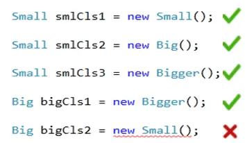

# Delegate

- Delegates are a `Type-Safe Function Pointer`[It means they hold the reference of a method or function and then call that method for execution] that represents `references to methods` with a specific `parameter list` and `return type`.

        <Access Modifier> delegate <Return Type> <Delegate Name> (Parameter List);

- They are widely used for implementing *`callback methods`, `event handling`, or `encapsulating method references`*.

## Invoke Delegate

- A Delegate can be invoked using the `Invoke()` method or using the `()` operator:-

        1. <Delegate Name> (Parameter List);
        2. <Delegate Name>.invoke(Parameter List)

## Types of delegate

### Single cast delegate

- It refers to a delegate that holds a reference to a single method.
- Key Features:
  - Holds reference to only one method at a time.
  - If reassigned, the previous method reference is overwritten.

- Example:

```c#
using System;

public delegate int Operation(int x, int y);

public class Program
{
    public static void Main(string[] args)
    {
        // Assign a single method to the delegate
        Operation op = Add;

        Console.WriteLine($"Result: {op(5, 10)}");
    }

    public static int Add(int a, int b)
    {
        return a + b;
    }
}
```

### Multicast Delegate

- A multicast delegate can hold references to multiple methods. When invoked, it calls all methods in the invocation list in sequence.
- Key Features:
    - Supports combining multiple methods using `+=`.
    - Can remove methods using `-=`.

```c#
using System;

public delegate void Notify(string message);

public class Program
{
    public static void Main()
    {
        // Create a multicast delegate
        Notify notify = NotifyViaEmail;
        notify += NotifyViaSMS;

        notify("Welcome to Multicast Delegates!");

        // Remove a method from the delegate
        notify -= NotifyViaEmail;

        notify("This will only notify via SMS.");
    }

    public static void NotifyViaEmail(string message)
    {
        Console.WriteLine("Email Notification: {0}", message);
    }

    public static void NotifyViaSMS(string message)
    {
        Console.WriteLine("SMS Notification: {0}", message);
    }
}
```

<details>
<summary>Output</summary>

```
Email Notification: Welcome to Multicast Delegates!
SMS Notification: Welcome to Multicast Delegates!
SMS Notification: This will only notify via SMS.
```

</details>

#### Multicast Delegate Returning a Value

- If a delegate returns a value, then the last assigned target method's value will be return when a multicast delegate called.

```c#
public delegate int MyDelegate(); //declaring a delegate

class Program
{
    static void Main(string[] args)
    {
        MyDelegate del1 = ClassA.MethodA;
        MyDelegate del2 = ClassB.MethodB;

        MyDelegate del = del1 + del2; 
        Console.WriteLine(del());// returns 200
    }
}

class ClassA
{
    static int MethodA()
    {
        return 100;
    }
}

class ClassB
{
    static int MethodB()
    {
        return 200;
    }
}
```

### Anonymous Delegates

- An anonymous delegate is a method defined inline using the delegate keyword, without specifying a separate method.
- Key Features:
    - Useful for small, short-lived methods.
    - Declared inline where they are needed.

- Example:

```c#
using System;

public delegate int Operation(int x, int y);

public class Program
{
    public static void Main(string[] args)
    {
        // Anonymous delegate
        Operation op = delegate (int a, int b)
        {
            return a * b;
        };

        Console.WriteLine($"Multiplication: {op(3, 4)}");
    }
}
```

### Generic Delegates

- .NET provides predefined generic delegates for commonly used scenarios. The most common ones are:
    - `Func`: Represents a method that returns a value.
    - `Action`: Represents a method that performs an action and does not return a value.
    - `Predicate`: Represents a method that defines a set of criteria and returns true or false.

- Key Features:
    - Simplifies delegate declaration.
    - Reduces boilerplate code.

- Overview

|              | Function          | Action	| Predicate |
| ------------ | ----------------- | ------ | --------- |
| Return type  |  Int,float, etc.. | void   | Bool      |
| Input Param  |	0-16           | 0-16   |	1       |
| Output Param |	1              | 0 	    | 1 (Bool)  |
| Ref and Out  |  X (not allowed)  | X      | 	X       |
| anonymous methods or lambda expressions. | ✅(Allowed) | ✅ | ✅ |

> `Predicate`: must take one input parameter and return a Boolean - true or false.

#### Func

```c#
// Func delegate for a method that returns a value
Func<int, int, string> add = (a, b) => (a + b).ToString();
Console.WriteLine($"Addition: {add(10, 20)}");
```

#### Action

```c#
// Action delegate for a method with no return value
Action<string> greet = message => Console.WriteLine($"Hello, {message}!");
greet("World");
```

#### Predicate

```c#
// Predicate delegate for a method that returns a boolean
Predicate<int> isEven = num => num % 2 == 0;
Console.WriteLine($"Is 4 even? {isEven(4)}");
Console.WriteLine($"Is 5 even? {isEven(5)}");
```

## Covariance and Contravariance in C#

```c#
public class Small
{ 

}
public class Big: Small
{

}
public class Bigger : Big
{ 
    
}
```



> As you can see above, a base class can hold a derived class but a derived class cannot hold a base class. In other word, an instance can accept big even if it demands small, but it cannot accept small if it demands big.


- [https://www.tutorialsteacher.com/csharp/csharp-covariance-and-contravariance](https://www.tutorialsteacher.com/csharp/csharp-covariance-and-contravariance)

## References

- 	https://www.tutorialsteacher.com/csharp/csharp-delegates
- 	https://www.tutorialsteacher.com/csharp/csharp-func-delegate
- 	https://www.tutlane.com/tutorial/csharp/csharp-delegates
- 	https://www.programiz.com/csharp-programming/delegates
- 	https://www.programiz.com/csharp-programming/lambda-expression
