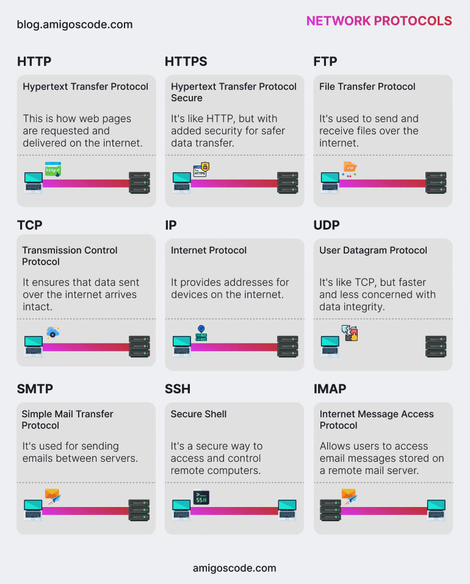

# Networking

## 𝟵 𝗘𝘀𝘀𝗲𝗻𝘁𝗶𝗮𝗹 𝗡𝗲𝘁𝘄𝗼𝗿𝗸 𝗣𝗿𝗼𝘁𝗼𝗰𝗼𝗹𝘀 𝗘𝘃𝗲𝗿𝘆 𝗗𝗲𝘃𝗲𝗹𝗼𝗽𝗲𝗿 𝗦𝗵𝗼𝘂𝗹𝗱 𝗞𝗻𝗼𝘄 🌐

- [x] ✅ HTTP (Hypertext Transfer Protocol): Requests and delivers web pages over the internet.
- [x] ✅ HTTPS (Hypertext Transfer Protocol Secure): Similar to HTTP but with enhanced security 🔒 for secure data transmission.
- [x] ✅ FTP (File Transfer Protocol): Used for transferring files 📁 over the internet.
- [x] ✅ TCP (Transmission Control Protocol): Ensures data is transmitted accurately and intact across the network.
- [x] ✅ IP (Internet Protocol): Assigns addresses to devices on the internet.
- [x] ✅ UDP (User Datagram Protocol): A faster alternative to TCP, prioritising speed over data integrity 🚀.
- [x] ✅ SMTP (Simple Mail Transfer Protocol): Handles the sending of emails 📧 between servers.
- [x] ✅ SSH (Secure Shell): Provides secure access to remote computers.
- [x] ✅ IMAP (Internet Message Access Protocol): Allows users to retrieve and manage emails from a remote server.

Network Protocol GIF

- References
> https://www.linkedin.com/posts/sosamsony_webdevelopment-frontenddeveloper-userexperience-activity-7262462729758593025-TaBf?utm_source=share&utm_medium=member_desktop

